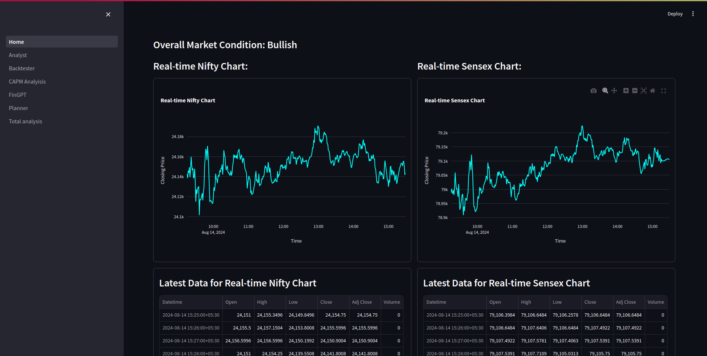
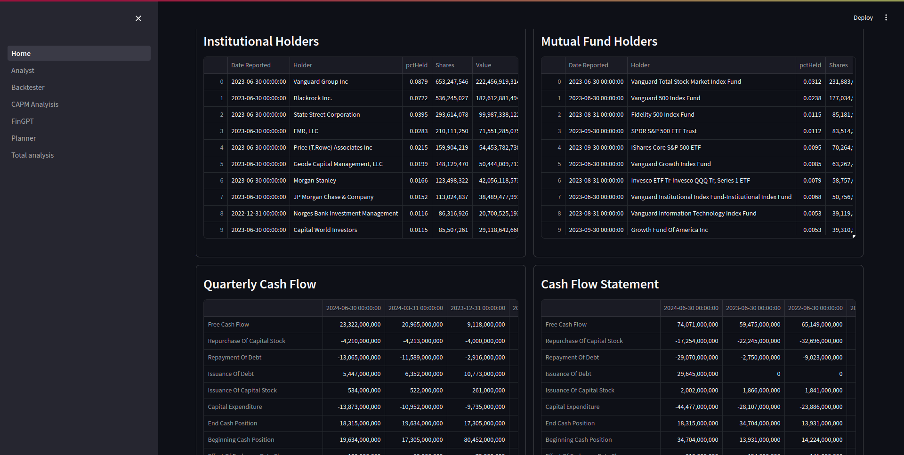
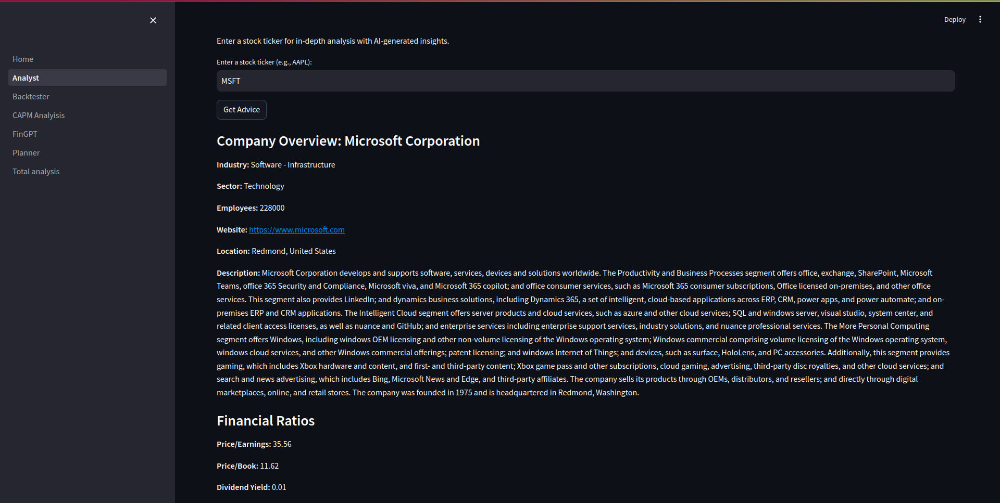
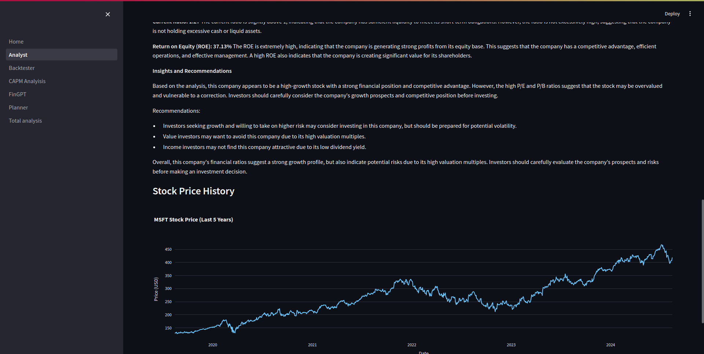
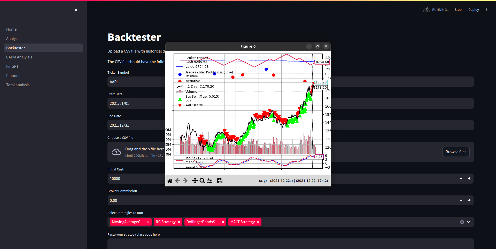
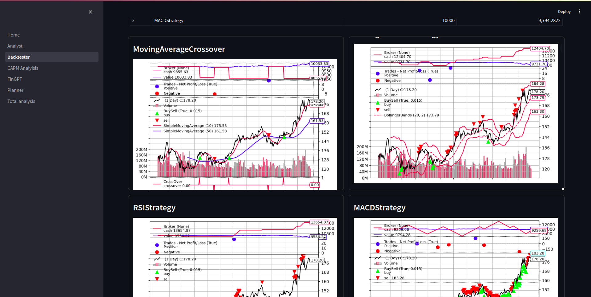
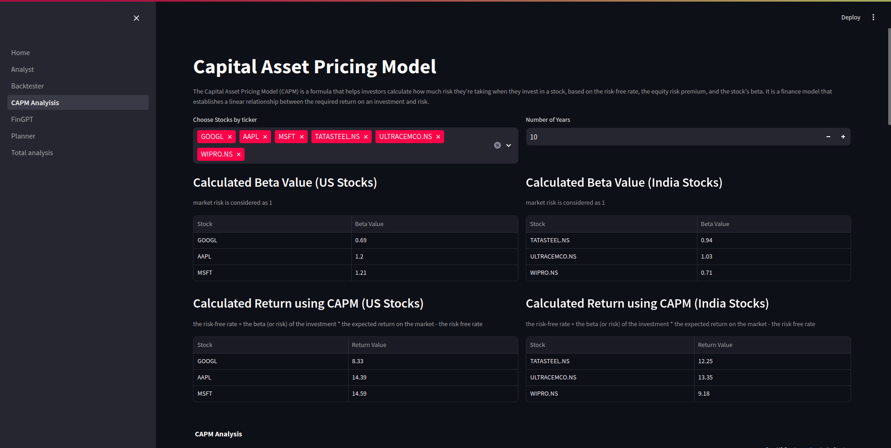
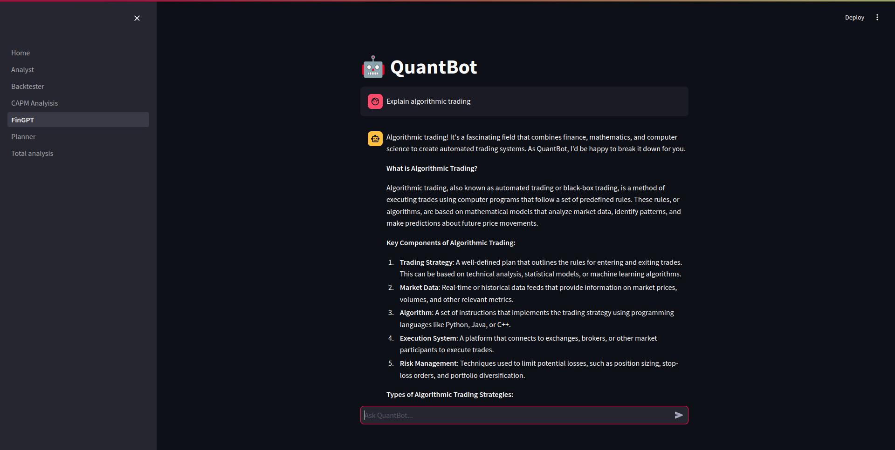
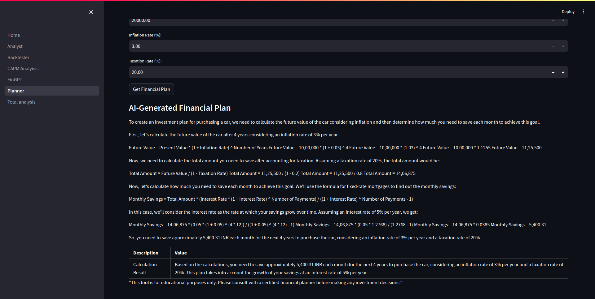
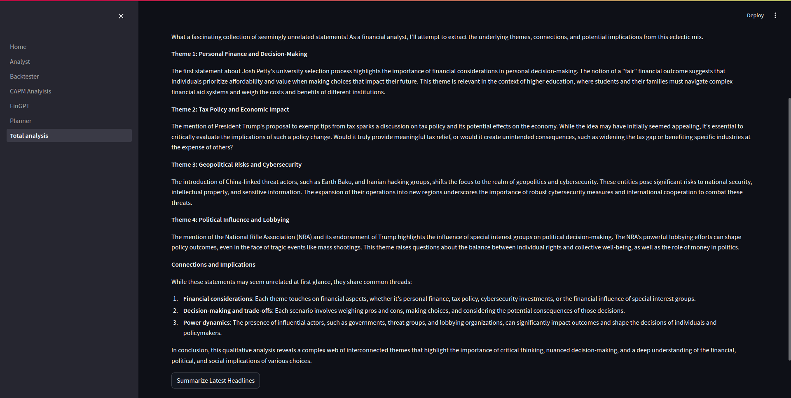

## Quant-Quips: Streamlining Financial Data Analysis

Quant-Quips is a platform designed to simplify and enhance the interaction with financial datasets. Utilizing modern technology, it provides users with intuitive tools for data analysis and visualization, making quantitative analysis more accessible and efficient.

This project is focused on leveraging Generative AI to make informed decisions in Algorithmic trading and Analysis of markets in semantic perspectives.

This project offers you backtester, your own analyst and planner of finances.
Has various data boards and analysis tools like CAPM, Stock ticker analysis etc.

### Features:

- All in one backtester-analyser-planner
- Helps to take informed risks in market and mitigates risks presented by misinformation.

### Technologies Used

- Streamlit
- GROQ
- NEWS API
- yFinance

### Installation:

To get started with QuantQuips Revamped, follow these steps:

```bash
# Clone the repository
git clone https://github.com/BipinRajC/Quant-Quips.git

#Create virtual env
python -m venv env

#activate the environment
source ./env/scripts/activate

#install all dependencies
pip install -r requirements.txt

#start the app and explore !
streamlit run Home.py
```

### Project Screenshots:


_Home page with dashboard_


_Gives total view of stocks in home page_


_analyst provides insights on each company financials_


_It even interprets graphs_


_Backtesting allows interactive graphs_


_Multiple strategies tested together_


_CAPM model analysis for risk calculation_


_Personalised LLM model for Code generation and analysis_


_Financial planner to achieve financial goals based on realisitc calculations and Natural language processing_


_Financial news fetching and analysis using generative AI_


_Detailed analysis to save time and increase awareness_
